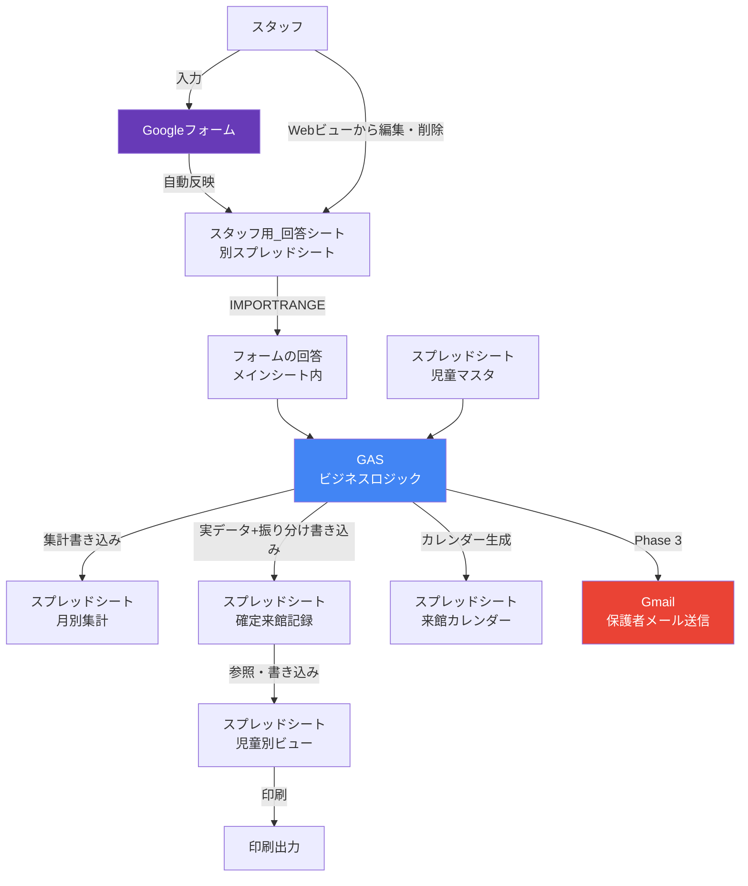
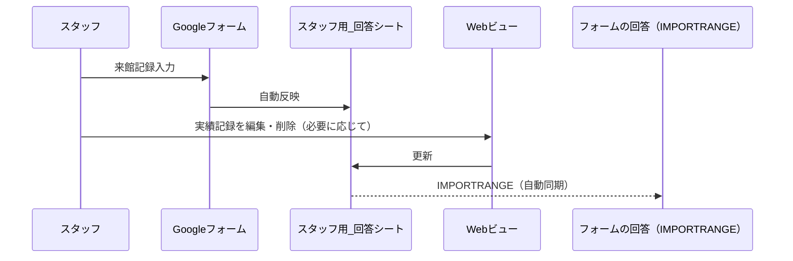
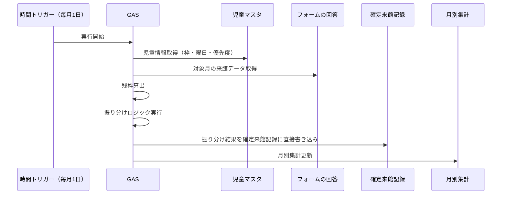
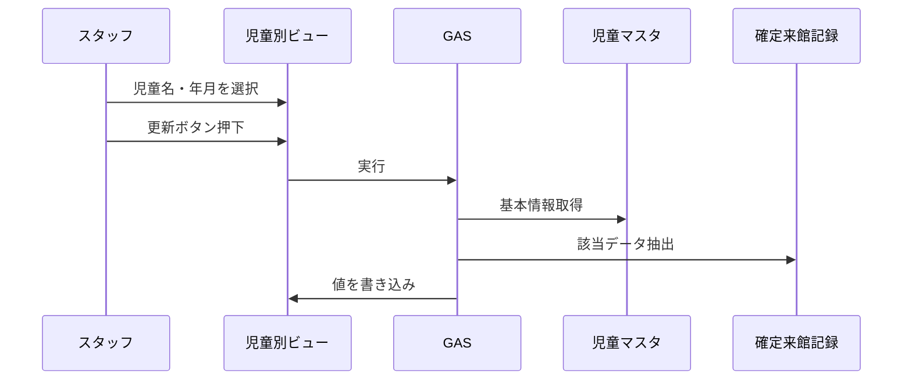

# システム構成図

## 全体アーキテクチャ



## コンポーネント説明

| コンポーネント | 役割 | 使用技術 |
|---|---|---|
| Googleフォーム | スタッフの来館記録入力UI | Google Forms |
| スプレッドシート | データストア + 閲覧UI | Google Sheets |
| GAS | 集計・振り分け・データ統合のビジネスロジック | Google Apps Script (JavaScript) |
| Gmail | 保護者への来館報告メール送信（Phase 3） | Gmail API via GAS |

## GAS処理フロー

### 実績記録の入力・編集フロー



### 月初自動振り分け（月初1日トリガー）



### 児童別ビュー更新（手動ボタン）



## トリガー一覧

| トリガー種別 | タイミング | 実行関数 | Phase |
|---|---|---|---|
| onEdit | セル編集時 | updateChildView（B1/B2/B3変更時）, updateVisitCalendar（B1変更時）, updateMonthlySummary（B1/B2変更時）, filterConfirmedVisits_（B1/B2変更時） | 1 |
| 時間ベース | 毎月1日 午前3時 | runMonthlyProcessAutomatic（前月を対象に処理） | 1+2 |
| 時間ベース | 毎朝8時 | sendDailyVisitReports | 3 |
| onChange | ログシート変更時 | notifyErrorLog | 3 |
| メニュー | 手動 | runMonthlyProcess（月次一括処理・選択肢は前月まで） | 1+2 |
| メニュー | 手動 | updateConfirmedVisitsAndCalendar | 1 |
| メニュー | 手動 | sendVisitReportsManual | 3 |
| メニュー | 手動 | refreshDropdowns | 1 |

## ビューシートのレイアウト（年/月分離）

各ビューシートは対象年と対象月を別セルで指定する。組合せで期間スコープ（month / year / month_all_years / all）を決定。

| シート | B1 | B2 | B3 | データ開始行 | デフォルト |
|---|---|---|---|---|---|
| 月別集計 | 対象年 | 対象月 | — | 4行目 | 最新年 / すべて |
| 確定来館記録 | 対象年 | 対象月 | — | 4行目 | 前月年 / 前月 |
| 来館カレンダー | 対象年 | — | — | 4行目 | 最新年 |
| 児童別ビュー | 児童名 | 対象年 | 対象月 | 10行目 | — / すべて / すべて |

- 年選択肢：`["すべて", "2026年", "2025年", ...]`（フォーム回答から抽出、降順）
- 月選択肢：`["すべて", "1月", ..., "12月"]`
- `buildScope_(yearStr, monthStr)` がスコープオブジェクトを構築、各ビューが共通利用

## ファイル構成（GAS）

```
gas/
├── main.gs              # エントリポイント・メニュー・トリガー管理
├── setup.gs             # F-01: シート初期セットアップ
├── monthly-summary.gs   # F-02: 月別集計更新（スコープ対応）
├── confirmed-visits.gs  # F-03: 確定来館記録生成
├── child-view.gs        # F-04: 児童別ビュー更新（スコープ対応）
├── visit-calendar.gs    # 来館カレンダー（年単位、日×児童マトリクス）
├── allocation.gs        # F-05/F-06: 余りポイント振り分け（設定シート値を使用）
├── form-sync.gs         # Googleフォームのスタッフ・児童プルダウン同期
├── web-view.gs          # Webアプリサーバサイド（フォーム回答修正ツール）
├── index.html           # Webアプリ画面
├── email.gs             # F-07: 保護者メール送信、F-10: エラー通知メール
├── bounce-checker.gs    # メールバウンス検出
└── utils.gs             # 共通ユーティリティ（定数・スコープ関数・ヘルパー）
```
