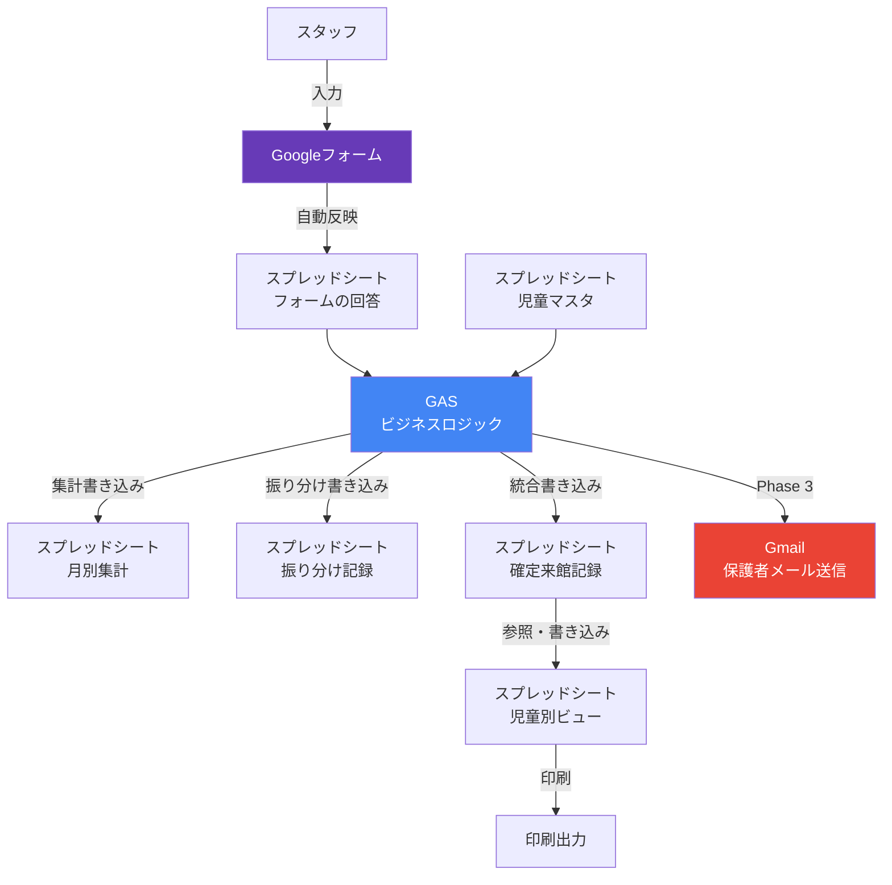
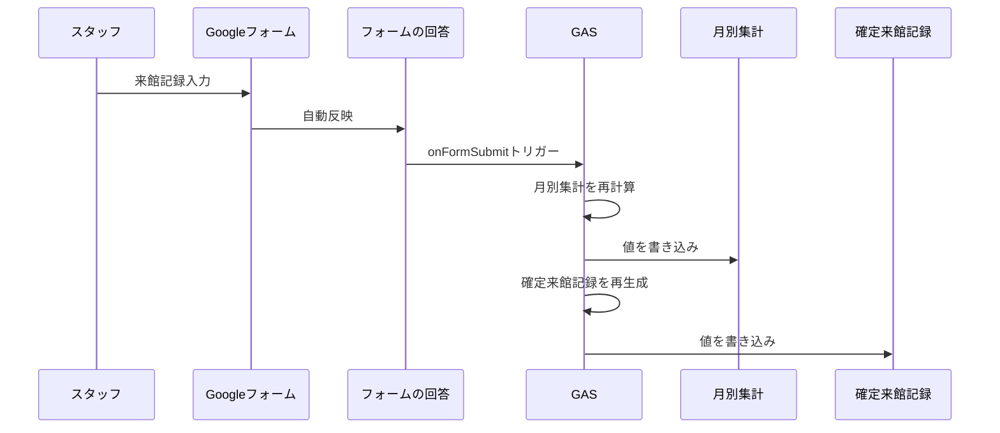
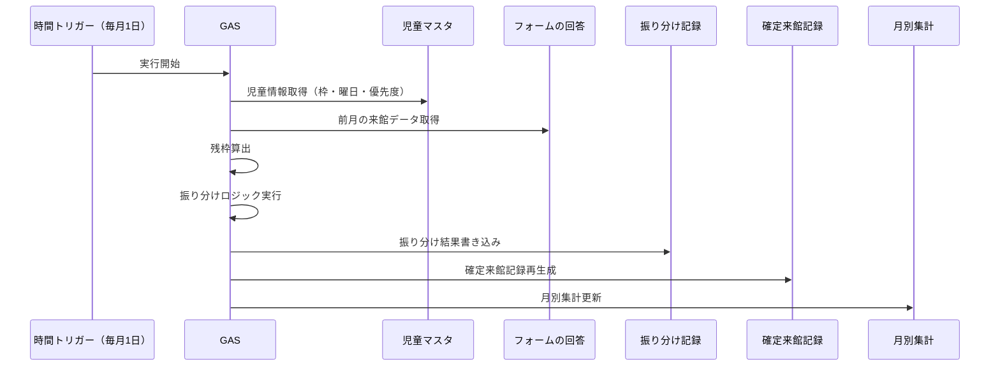
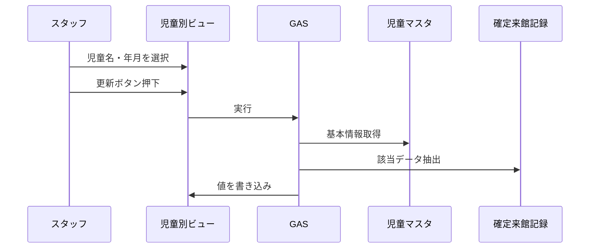

# システム構成図

## 全体アーキテクチャ



## コンポーネント説明

| コンポーネント | 役割 | 使用技術 |
|---|---|---|
| Googleフォーム | スタッフの来館記録入力UI | Google Forms |
| スプレッドシート | データストア + 閲覧UI | Google Sheets |
| GAS | 集計・振り分け・データ統合のビジネスロジック | Google Apps Script (JavaScript) |
| Gmail | 保護者への来館報告メール送信（Phase 3） | Gmail API via GAS |

## GAS処理フロー

### フォーム送信時トリガー



### 月初自動振り分け（月初1日トリガー）



### 児童別ビュー更新（手動ボタン）



## トリガー一覧

| トリガー種別 | タイミング | 実行関数 | Phase |
|---|---|---|---|
| onFormSubmit | フォーム送信時 | updateMonthlySummary, generateConfirmedRecords | 1 |
| 時間ベース | 毎月1日 | autoAllocatePoints | 2 |
| 時間ベース | 毎朝（時刻指定） | sendParentEmail | 3 |
| ボタン | 手動 | updateMonthlySummary | 1 |
| ボタン | 手動 | updateChildView | 1 |
| ボタン | 手動 | runAllocation | 2 |

## ファイル構成（GAS）

```
gas/
├── main.gs              # エントリポイント・トリガー管理
├── setup.gs             # F-01: シート初期セットアップ
├── monthly-summary.gs   # F-02: 月別集計更新
├── confirmed-visits.gs  # F-03: 確定来館記録生成
├── child-view.gs        # F-04: 児童別ビュー更新
├── allocation.gs        # F-05/F-06: 余りポイント振り分け
├── email.gs             # F-07: 保護者メール送信（Phase 3）
├── monthly-close.gs     # F-08: 月次確定処理（Phase 3）
└── utils.gs             # 共通ユーティリティ
```
