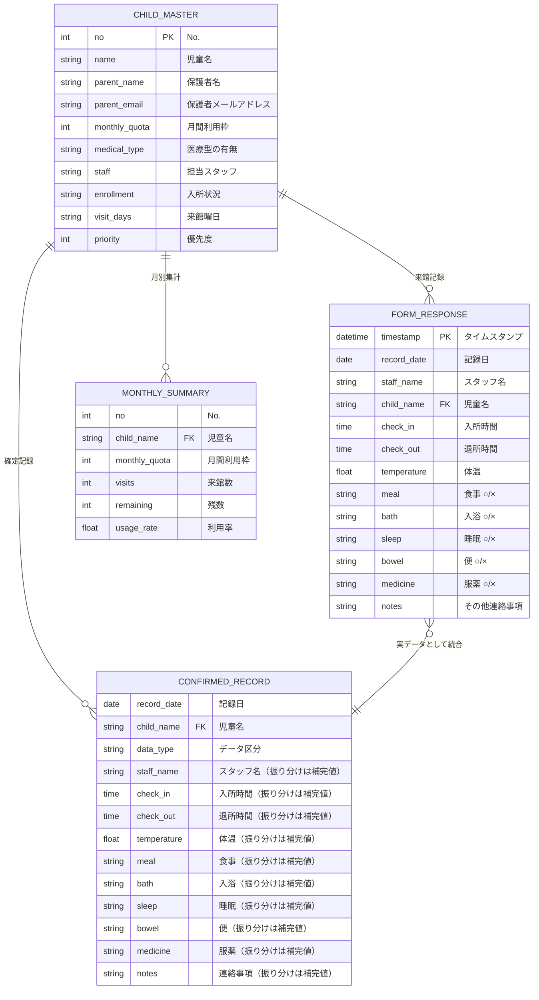

# ER図・データ設計

## ER図



## シート間データ関係

```
児童マスタ (CHILD_MASTER)
  ├──→ フォームの回答 (FORM_RESPONSE)    ※児童名で紐付け
  ├──→ 確定来館記録 (CONFIRMED_RECORD)    ※児童名で紐付け
  └──→ 月別集計 (MONTHLY_SUMMARY)         ※児童名で紐付け

フォームの回答 ──→ 確定来館記録 ──→ 児童別ビュー
                   (実データ+振り分け)     来館カレンダー
                                          月別集計
```

## シート定義詳細

### シート: 児童マスタ

| カラム | 列 | 型 | NOT NULL | 説明 |
|--------|-----|------|----------|------|
| No. | A | 数値 | ✓ | 一意識別子 |
| 児童名 | B | テキスト | ✓ | |
| 保護者名 | C | テキスト | ✓ | |
| 保護者メールアドレス | D | テキスト | ✓ | |
| 月間利用枠 | E | 数値 | ✓ | 1〜7 |
| 医療型の有無 | F | テキスト | ✓ | あり / なし |
| 担当スタッフ | G | テキスト | | |
| 入所状況 | H | テキスト | ✓ | 稼働 / 休止 / 退所 |
| 来館曜日 | I | テキスト | ✓ | 例: 月,水,金 |
| 優先度 | J | 数値 | ✓ | 1が最優先 |

### シート: フォームの回答

| カラム | 列 | 型 | NOT NULL | 説明 |
|--------|-----|------|----------|------|
| タイムスタンプ | A | 日時 | ✓ | 自動生成 |
| 記録日 | B | 日付 | ✓ | スタッフが入力 |
| スタッフ名 | C | テキスト | ✓ | |
| 児童名 | D | テキスト | ✓ | プルダウン選択 |
| 入所時間 | E | 時刻 | ✓ | |
| 退所時間 | F | 時刻 | | |
| 体温 | G | 数値 | | |
| 食事 | H | テキスト | | ○ / × |
| 入浴 | I | テキスト | | ○ / × |
| 睡眠 | J | テキスト | | ○ / × |
| 便 | K | テキスト | | ○ / × |
| 服薬 | L | テキスト | | ○ / × |
| その他連絡事項 | M | テキスト | | |

### シート: 確定来館記録

| カラム | 列 | 型 | NOT NULL | 説明 |
|--------|-----|------|----------|------|
| 記録日 | A | 日付 | ✓ | |
| 児童名 | B | テキスト | ✓ | |
| データ区分 | C | テキスト | ✓ | 実データ / 振り分け |
| スタッフ名 | D | テキスト | | 振り分けは振り分け記録の補完値 |
| 入所時間 | E | 時刻 | | 振り分けは振り分け記録の補完値 |
| 退所時間 | F | 時刻 | | 振り分けは振り分け記録の補完値 |
| 体温 | G | 数値 | | 振り分けは振り分け記録の補完値 |
| 食事 | H | テキスト | | 振り分けは振り分け記録の補完値 |
| 入浴 | I | テキスト | | 振り分けは振り分け記録の補完値 |
| 睡眠 | J | テキスト | | 振り分けは振り分け記録の補完値 |
| 便 | K | テキスト | | 振り分けは振り分け記録の補完値 |
| 服薬 | L | テキスト | | 振り分けは振り分け記録の補完値 |
| その他連絡事項 | M | テキスト | | 振り分けは振り分け記録の補完値 |

### シート: 月別集計（GASで値書き込み）

| カラム | 列 | 型 | 説明 |
|--------|-----|------|------|
| No. | A | 数値 | 児童マスタ参照 |
| 児童名 | B | テキスト | 児童マスタ参照 |
| 月間利用枠 | C | 数値 | 児童マスタ参照 |
| 来館数 | D | 数値 | 確定来館記録から集計 |
| 残数 | E | 数値 | C - D |
| 利用率 | F | 数値 | D / C（%表示） |

※ 1行目=操作エリア（B1=対象年月）、2行目=ヘッダー、3行目〜=データ
