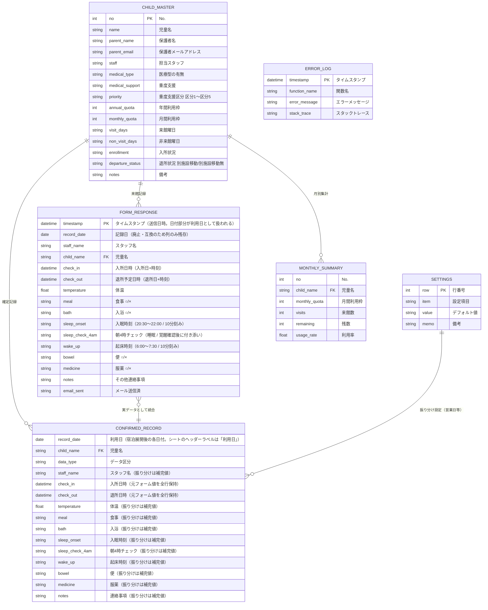

# ER図・データ設計

## ER図



## シート間データ関係

```
児童マスタ (CHILD_MASTER)
  ├──→ フォームの回答 (FORM_RESPONSE)    ※児童名で紐付け
  ├──→ 確定来館記録 (CONFIRMED_RECORD)    ※児童名で紐付け
  └──→ 月別集計 (MONTHLY_SUMMARY)         ※児童名で紐付け

フォームの回答 ──→ 確定来館記録 ──→ 児童別ビュー
  │               (実データ+振り分け)     来館カレンダー
  └──────────────────────────────────→ 月別集計（実記録のみ集計）
```

## シート定義詳細

### シート: 児童マスタ

| カラム | 列 | 型 | NOT NULL | 説明 |
|--------|-----|------|----------|------|
| No. | A | 数値 | ✓ | 一意識別子 |
| 児童名 | B | テキスト | ✓ | |
| 保護者名 | C | テキスト | ✓ | |
| 保護者メールアドレス | D | テキスト | ✓ | |
| 担当スタッフ | E | テキスト | | |
| 医療型の有無 | F | テキスト | ✓ | あり / なし |
| 重度支援 | G | テキスト | | あり / なし |
| 重度支援区分 | H | テキスト | | 区分1〜区分5（プルダウン）。振り分け優先順位（区分1が最優先） |
| 年間利用枠 | I | 数値 | | 年間の利用日数上限。空欄の場合は上限なし |
| 月間利用枠 | J | 数値 | ✓ | |
| 来館曜日 | K | テキスト | | 例: 月,水,金 |
| 非来館曜日 | L | テキスト | | 振り分けの候補日から除外する曜日 |
| 入所状況 | M | テキスト | ✓ | 稼働 / 休止 / 退所 |
| 退所状況 | N | テキスト | | 別施設移動 / 別施設移動無（プルダウン）。退所時の振り分け制御 |
| 備考 | O | テキスト | | |

### シート: 設定

| カラム | 列 | 型 | 説明 |
|--------|-----|------|------|
| 設定項目 | B | テキスト | 設定名称 |
| デフォルト値 | C | 任意 | 設定値 |
| 備考 | D | テキスト | |

| 行 | 設定項目 | 説明 |
|----|---------|------|
| 2 | 1日最大来館数 | 振り分け上限（デフォルト: 7） |
| 3 | 入所時間 | 振り分け補完値のデフォルト |
| 4 | 退所時間 | 振り分け補完値のデフォルト |
| 5 | 営業日 | 振り分け対象曜日。空欄=全曜日対象 |
| 6 | 体温 | 振り分け補完値のデフォルト |
| 7 | 食事 | 振り分け補完値のデフォルト |
| 8 | 入浴 | 振り分け補完値のデフォルト |
| 11 | 入眠時刻 | 振り分け補完値のデフォルト（20:30〜22:00 / 10分刻み） |
| 12 | 朝4時チェック | 振り分け補完値のデフォルト（睡眠 / 覚醒確認後に付き添い） |
| 13 | 起床時刻 | 振り分け補完値のデフォルト（6:00〜7:30 / 10分刻み） |
| 14 | 便 | 振り分け補完値のデフォルト |
| 15 | 服薬(朝) | 振り分け補完値のデフォルト |
| 16 | 服薬(夜) | 振り分け補完値のデフォルト |
| 17 | 連絡事項 | 振り分け補完値のデフォルト |
| 18 | 固定スタッフ名 | 振り分け行のスタッフ1・満枠日のスタッフ2に使用 |
| 19 | エラー通知先メール | カンマ区切りで複数指定可 |
| 20 | メール件名 | メールテンプレート |
| 21 | メール本文 | メールテンプレート（プレースホルダー形式） |

### シート: フォームの回答

| カラム | 列 | 型 | NOT NULL | 説明 |
|--------|-----|------|----------|------|
| タイムスタンプ | A | 日時 | ✓ | 自動生成。日付部分が「利用日」として扱われる |
| 記録日 | B | 日付 | | フォーム入力は廃止（互換のため列のみ残存・新規データは空欄）。読取時は `getRowRecordDate_()` でタイムスタンプ日付にフォールバック |
| スタッフ1 | C | テキスト | ✓ | スタッフマスタから自動同期 |
| スタッフ2 | D | テキスト | | 任意。スタッフマスタから自動同期 |
| 児童名 | E | テキスト | ✓ | プルダウン選択 |
| 入所日時 | F | 日時 | ✓ | 入所日+時刻 |
| 退所予定日時 | G | 日時 | ✓ | 退所日+時刻 |
| 体温 | H | 数値 | | |
| 夕食 | I | テキスト | | ○ / × / 完食 / 半分 等 |
| 朝食 | J | テキスト | | ○ / × / 完食 / 半分 等 |
| 昼食 | K | テキスト | | 他サービス併給時は「-」 |
| 入浴 | L | テキスト | | ○ / × |
| 入眠時刻 | M | テキスト | ✓ | プルダウン: 20:30〜22:00（10分刻み） |
| 朝4時チェック | N | テキスト | ✓ | プルダウン: 睡眠 / 覚醒確認後に付き添い |
| 起床時刻 | O | テキスト | ✓ | プルダウン: 6:00〜7:30（10分刻み） |
| 便 | P | テキスト | | ○ / × |
| 服薬(夜) | Q | テキスト | | ○ / × |
| 服薬(朝) | R | テキスト | | ○ / × |
| その他連絡事項 | S | テキスト | | |
| メール送信済 | T | テキスト | | GAS自動書き込み。「送信済 yyyy/MM/dd HH:mm」形式 |

### シート: ログ（エラーログ）

| カラム | 列 | 型 | NOT NULL | 説明 |
|--------|-----|------|----------|------|
| タイムスタンプ | A | 日時 | ✓ | エラー発生日時 |
| 関数名 | B | テキスト | ✓ | エラーが発生した関数名 |
| エラーメッセージ | C | テキスト | ✓ | |
| スタックトレース | D | テキスト | | |

### シート: 確定来館記録

列順はフォームの回答(2列目以降)と一致。1列目「データ区分」がフォームの「タイムスタンプ」と同位置。

| カラム | 列 | 型 | NOT NULL | 説明 |
|--------|-----|------|----------|------|
| データ区分 | A | テキスト | ✓ | 実データ / 振り分け |
| 利用日 | B | 日付 | ✓ | 入所日〜退所予定日を1日ずつ展開（旧名: 記録日） |
| スタッフ1 | C | テキスト | | 振り分けは固定スタッフ |
| スタッフ2 | D | テキスト | | 任意。満枠日は固定スタッフで補完 |
| 児童名 | E | テキスト | ✓ | |
| 入所日時 | F | 日時 | | フォーム入力値を全展開行に保持。振り分けは補完値 |
| 退所予定日時 | G | 日時 | | フォーム入力値を全展開行に保持。振り分けは補完値 |
| 送迎(往) | H | 数値 | | 利用日==入所日 → 1 |
| 送迎(復) | I | 数値 | | 利用日==退所予定日 → 1 |
| 体温 | J | 数値 | | 振り分けは補完値 |
| 夕食 | K | テキスト | | 振り分けは補完値 |
| 朝食 | L | テキスト | | 振り分けは補完値 |
| 昼食 | M | テキスト | | 振り分けは補完値 |
| 入浴 | N | テキスト | | 振り分けは補完値 |
| 入眠時刻 | O | テキスト | | 振り分けは補完値（20:30〜22:00 / 10分刻み） |
| 朝4時チェック | P | テキスト | | 振り分けは補完値（睡眠 / 覚醒確認後に付き添い） |
| 起床時刻 | Q | テキスト | | 振り分けは補完値（6:00〜7:30 / 10分刻み） |
| 便 | R | テキスト | | 振り分けは補完値 |
| 服薬(夜) | S | テキスト | | 振り分けは補完値 |
| 服薬(朝) | T | テキスト | | 振り分けは補完値 |
| その他連絡事項 | U | テキスト | | 振り分けは補完値 |

### シート: 月別集計（GASで値書き込み）

| カラム | 列 | 型 | 説明 |
|--------|-----|------|------|
| No. | A | 数値 | 児童マスタ参照 |
| 児童名 | B | テキスト | 児童マスタ参照 |
| 月間利用枠 | C | 数値 | 児童マスタ参照 |
| 来館数 | D | 数値 | フォームの回答（実記録）から集計 |
| 残数 | E | 数値 | C - D |
| 利用率 | F | 数値 | D / C（%表示） |

※ 1行目=操作エリア（B1=対象年月）、2行目=ヘッダー、3行目〜=データ
