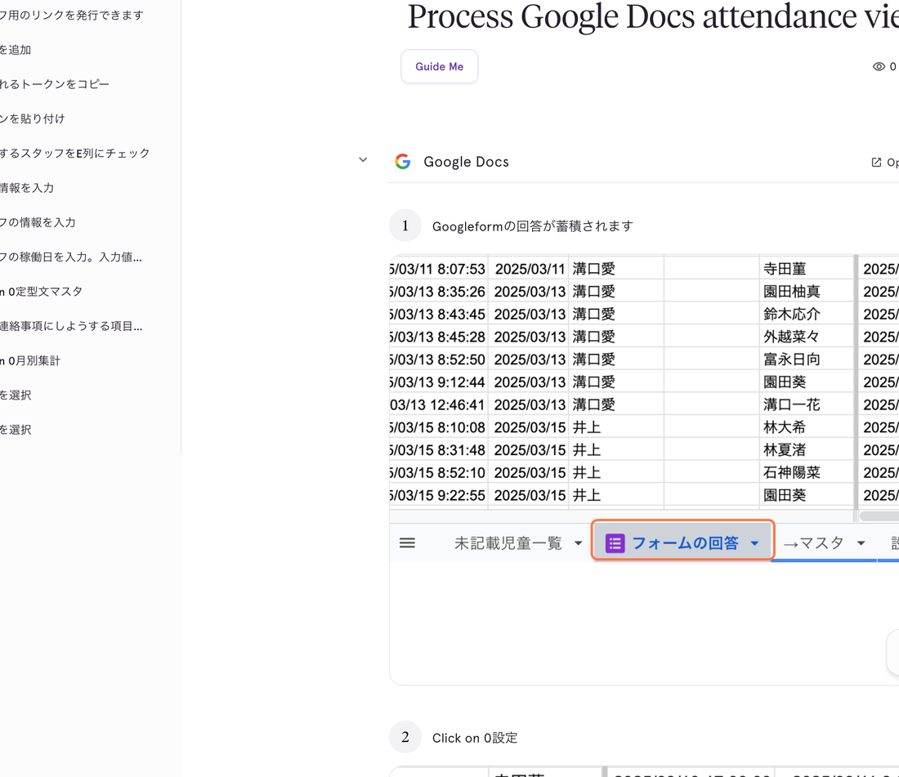

# 01. フォーム回答を確認する

## このページでやること

スタッフがGoogleフォームで送信した来館記録が、スプレッドシートに反映されているかを確認します。

- **いつやるか**：毎日、フォームが送信されたあと
- **かかる時間**：1分くらい
- **誰がやるか**：日誌担当スタッフ

---

## 手順

### ① 「フォームの回答」シートを開く

スプレッドシート下部のタブから **「フォームの回答」** をクリックします。

### ② 送信された内容が上から順に並んでいます

フォームで送信されたデータは、送信時刻が新しいものが下に追加されていきます。
記録日・児童名・スタッフ名・入所/退所時間などが自動で入るので、手入力は不要です。

### ③ 表示されていない場合

- スプレッドシートを一度閉じて、もう一度開いてみてください。
- それでも反映されないときは管理者に連絡してください（フォームとスプレッドシートの連携が切れている可能性があります）。

---

## 間違えて送信してしまったときは

フォームの回答を直接スプレッドシートで書き換えてはいけません。
**Webビュー（修正・削除ツール）** を使って修正・削除してください。

- 詳しい操作方法 → [フォーム回答の修正ツール 操作マニュアル](../manual_form-edit.md)

---

## 次にやること

- フォーム入力ルール（入所日時・退所予定日時の入れ方）を確認したい → [00_フォームを入力する.md](00_フォームを入力する.md)
- 毎日の確認が終わったら → [02_月別集計を見る.md](02_月別集計を見る.md)
