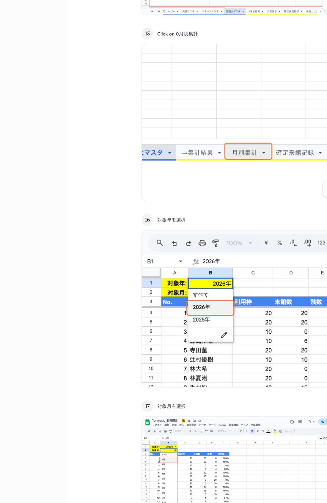

# 02. 月別集計を見る

## このページでやること

指定した年・月の**利用枠・来館数・残り枠・利用率**を一覧で確認します。
月ごとの利用状況をひと目で把握したいときに使います。

- **いつやるか**：毎月（月初や月末の振り返り時）
- **かかる時間**：1〜2分
- **誰がやるか**：管理担当スタッフ

---

## 手順

### ① 「月別集計」タブをクリック

スプレッドシート下部のタブから **「月別集計」** を選びます。
（オレンジ色の枠で囲まれているタブです）

### ② 「対象年」を選ぶ（B1セル）

シート左上の **B1セル（対象年）** をクリックすると、プルダウンが出ます。
見たい年（例：2026年）を選んでください。

> **ポイント**：「すべて」のままだと数字が集計されません。**必ず年を指定**してください。

### ③ 「対象月」を選ぶ（B2セル）

続けて **B2セル（対象月）** をクリックし、見たい月（例：1月）を選びます。

### ④ 表示を確認

選んだ年月の集計結果が、児童ごとに並んで表示されます。

| 列 | 意味 |
|---|---|
| No. | 児童番号 |
| 児童名 | 児童の名前 |
| 利用枠 | その月に使える上限回数 |
| 来館数 | 実際に来館した回数 |
| 残数 | 残っている利用枠（利用枠 − 来館数） |
| 利用率 | 利用枠に対する来館数の割合（％） |

---

## よくあるトラブル

| 症状 | 原因と対処 |
|---|---|
| すべての数字が0になる | 対象年または対象月が「すべて」のまま。プルダウンから具体的な年月を選んでください |
| 児童が表示されない | 児童マスタに登録されていない可能性があります。[10_児童を追加する.md](10_児童を追加する.md) を確認してください |
| 利用率が100%を超える | 利用枠を超えて来館している可能性があります。管理者に相談してください |

---

## 大事な注意

- 集計表の中の数字は**自動で計算**されます。直接書き換えないでください。
- B1（対象年）とB2（対象月）の**プルダウンのみ操作可能**です。

---

## 次にやること

- 実際の記録を確認したい → [03_確定来館記録を見る.md](03_確定来館記録を見る.md)
- カレンダーで見たい → [04_来館カレンダーを見る.md](04_来館カレンダーを見る.md)
