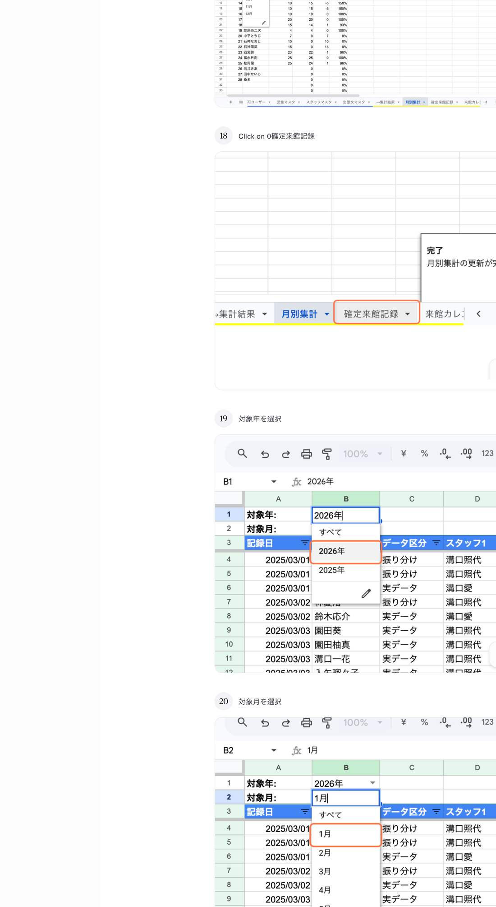
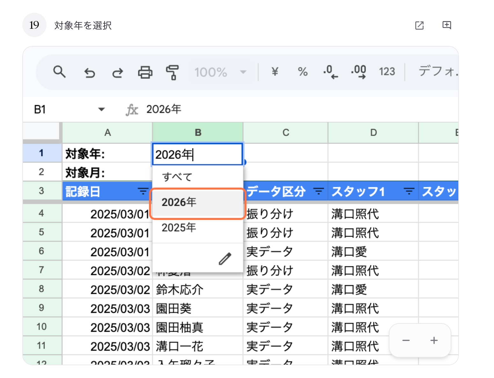
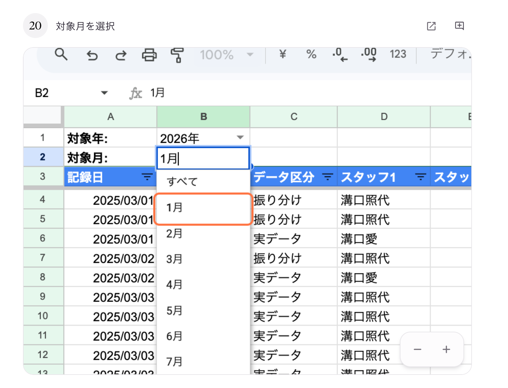

# 03. 確定来館記録を見る

## このページでやること

選んだ年・月の**すべての来館記録**（実データ + 振り分け予測）を一覧で確認します。
「このスタッフが何日に担当したか」「この児童がいつ来館したか」を詳細に見たいときに使います。

- **いつやるか**：毎月の実績確認時、個別の記録を遡って確認したいとき
- **かかる時間**：2〜3分
- **誰がやるか**：管理担当スタッフ

---

## 手順

### ① 「確定来館記録」タブをクリック

スプレッドシート下部のタブから **「確定来館記録」** を選びます。

### ② 「対象年」を選ぶ（B1セル）

**B1セル（対象年）** のプルダウンから見たい年を選びます。

### ③ 「対象月」を選ぶ（B2セル）

**B2セル（対象月）** のプルダウンから見たい月を選びます。

### ④ 表示された記録を確認

対象年月の全記録が日付順に並びます。

| 列 | 意味 |
|---|---|
| 利用日 | 来館した日（旧名: 記録日。2026-04 後半よりラベル変更） |
| データ区分 | 「実データ」=実際の記録、「振り分け」=予測された記録 |
| スタッフ1 / スタッフ2 | その日に担当したスタッフ |
| 入所時間 / 退所時間 | 来館時刻と帰宅時刻 |
| 体温・食事・入浴・便・服薬 | フォームで入力された様子 |
| 入眠時刻・朝4時チェック・起床時刻 | フォームで入力された睡眠まわりの3項目（旧「睡眠」○/× を置換） |
| 連絡事項 | フリーテキストの連絡内容 |

---

## 「実データ」と「振り分け」の違い

| データ区分 | 意味 |
|---|---|
| **実データ** | スタッフがフォームで送信した、実際に起きたことの記録 |
| **振り分け** | 「この児童はたぶんこの日に来る」というシステムの予測 |

振り分けは、児童マスタの来館予定とスタッフ稼働日をもとに自動で作られます。
実際に来館してフォームが送信されると、同じ日の振り分けは**自動で実データに置き換わります**。

---

## 大事な注意

- **「データ区分」列は絶対に書き換えないでください**。このフラグでシステムが実データと予測を区別しています。
- 記録を修正したい場合は、スプレッドシートではなく**Webビュー（修正ツール）**を使ってください → [フォーム回答の修正ツール 操作マニュアル](../manual_form-edit.md)

---

## よくあるトラブル

| 症状 | 原因と対処 |
|---|---|
| 記録が出てこない | B1/B2が「すべて」になっていないか確認 |
| 振り分けが残ったまま更新されない | 月次処理が未実行の可能性。管理者に「確定来館記録を手動更新」の実行を依頼してください |
| 入退所時間が逆になっている（宿泊記録） | フォーム入力時の日付順序が逆です。Webビューから修正してください |

---

## 次にやること

- カレンダー形式で見たい → [04_来館カレンダーを見る.md](04_来館カレンダーを見る.md)
- 特定の児童だけを見たい → [05_児童別ビューを見る.md](05_児童別ビューを見る.md)
