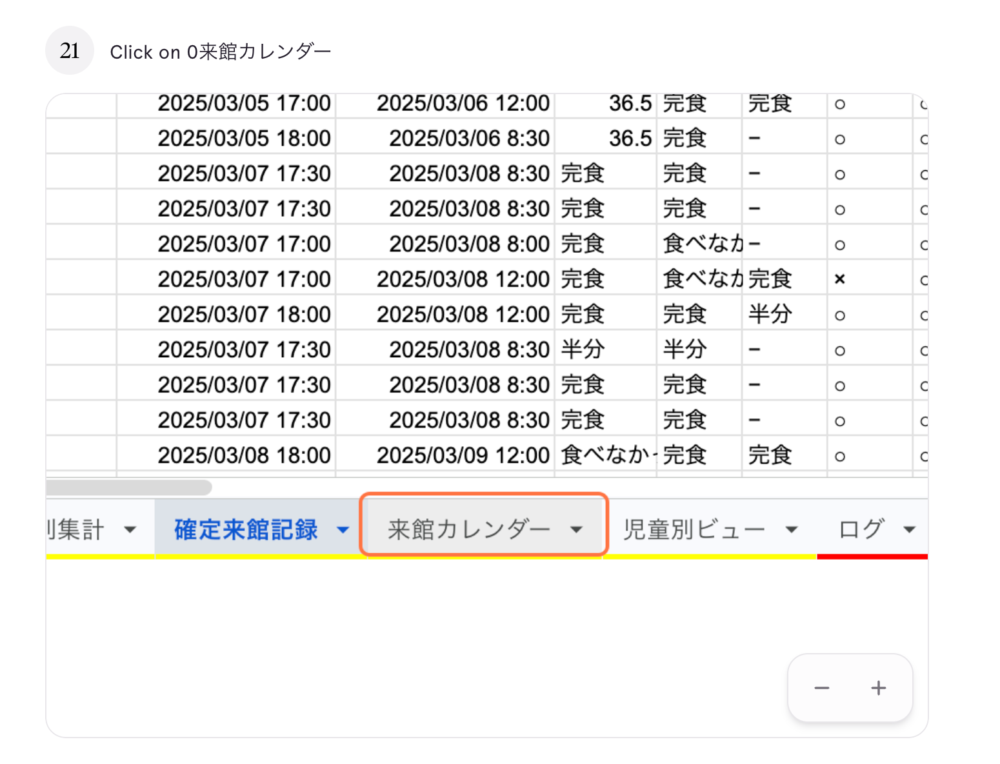
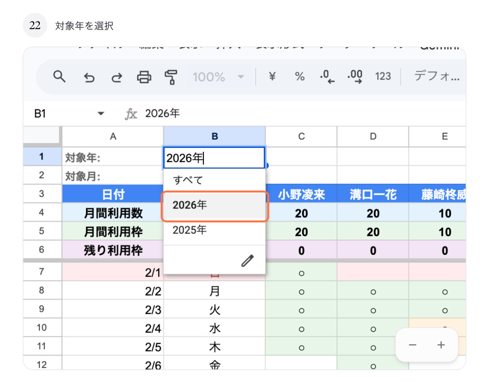
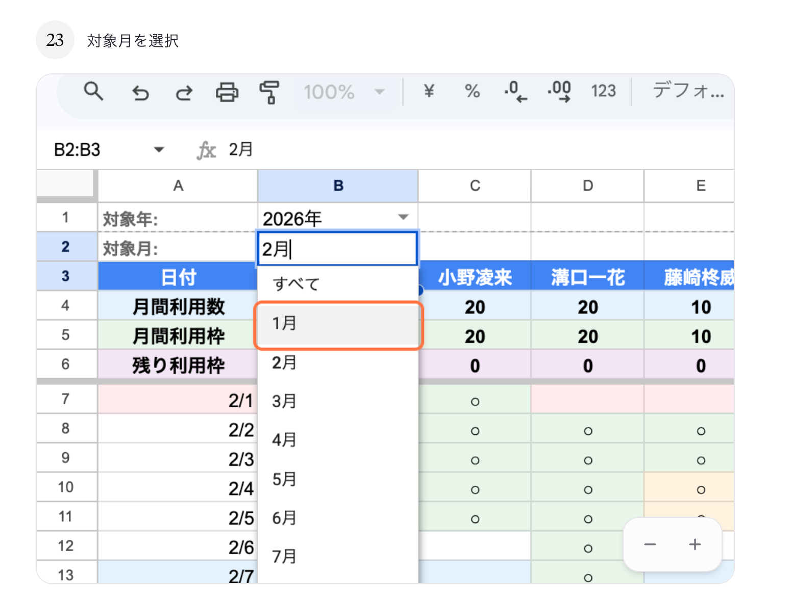

# 04. 来館カレンダーを見る

## このページでやること

選んだ年・月の来館状況を**カレンダー形式**で確認します。
「どの日に誰が来たか」が一目で分かります。

- **いつやるか**：毎月の全体把握、シフト調整や欠席状況の確認
- **かかる時間**：1〜2分
- **誰がやるか**：管理担当スタッフ

---

## 手順

### ① 「来館カレンダー」タブをクリック

スプレッドシート下部のタブから **「来館カレンダー」** を選びます。

### ② 「対象年」を選ぶ（B1セル）

**B1セル（対象年）** のプルダウンから見たい年を選びます。

### ③ 「対象月」を選ぶ（B2セル）

**B2セル（対象月）** のプルダウンから見たい月を選びます。

### ④ カレンダーの見方

縦に日付、横に児童名が並ぶマトリクス（表）形式で表示されます。

| マーク | 意味 |
|---|---|
| **○** | 来館した日（実データ）。緑色のセル |
| **△** | 来館予定（振り分け予測）。薄緑のセル |
| （空欄） | 来館なし |
| **赤いセル** | 来館予定だったのに記録がない（要確認） |

---

## こんなときに便利

- **欠席した子を探したい** → 来館予定（△）なのに実際の記録（○）がない日を探す
- **特定の日の来館者を確認したい** → 対象の日付の行を見て、○が付いている児童を確認
- **月全体の稼働を把握したい** → 全体を俯瞰してどれくらい埋まっているかをざっくり把握

---

## 大事な注意

- カレンダーの中身は**自動で作られます**。手入力で○や△を書かないでください。
- **B1（対象年）とB2（対象月）のプルダウンのみ操作可能**です。
- カレンダーが古いままの場合は、管理者に「**月次一括処理**」の実行を依頼してください。

---

## よくあるトラブル

| 症状 | 原因と対処 |
|---|---|
| 何も表示されない | B1/B2が「すべて」のまま。年月を指定してください |
| 予定（△）だけで実データ（○）が出ない | 月次処理が未実行。管理者に依頼してください |
| 日付がずれる | フォーム入力時に入所日時と退所日時が逆になっている可能性。Webビューで修正してください |

---

## 次にやること

- 特定の児童の記録を詳しく見たい → [05_児童別ビューを見る.md](05_児童別ビューを見る.md)
