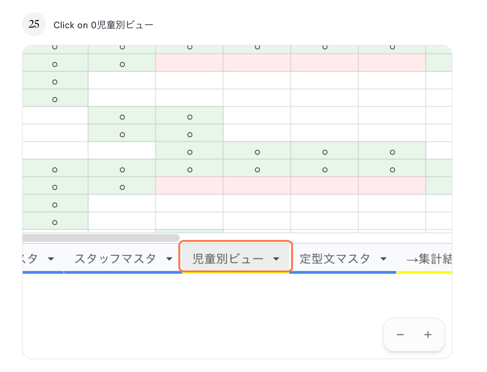
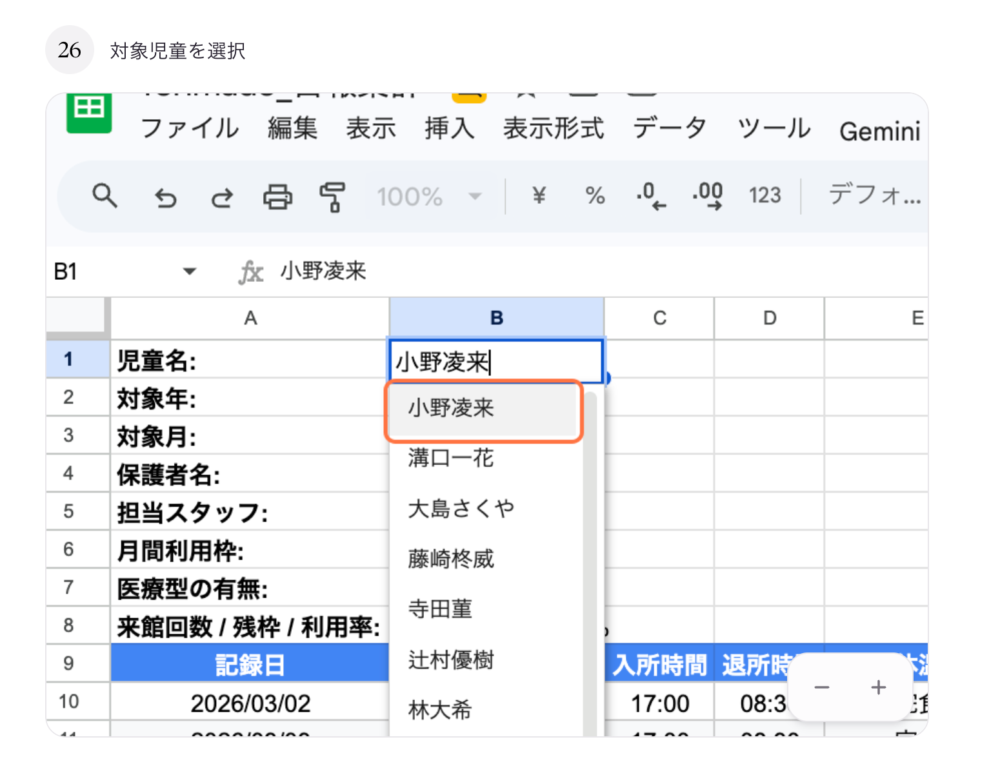
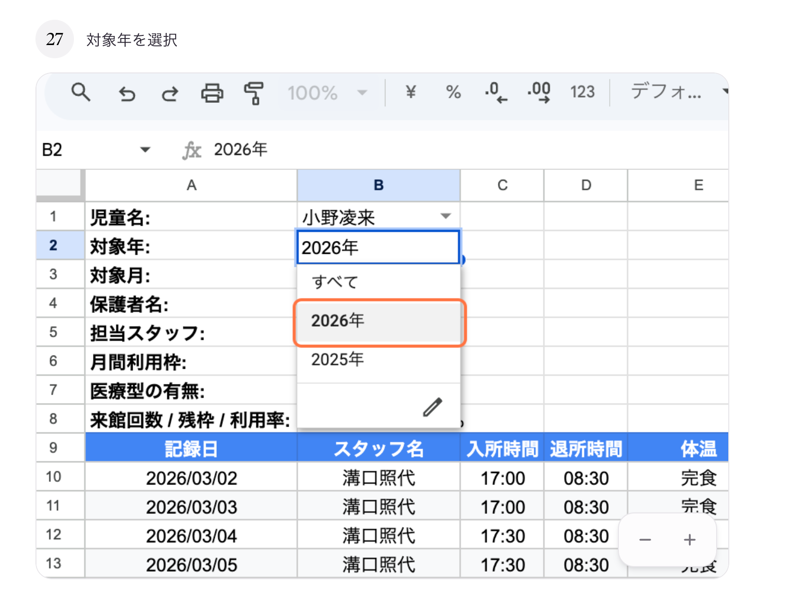
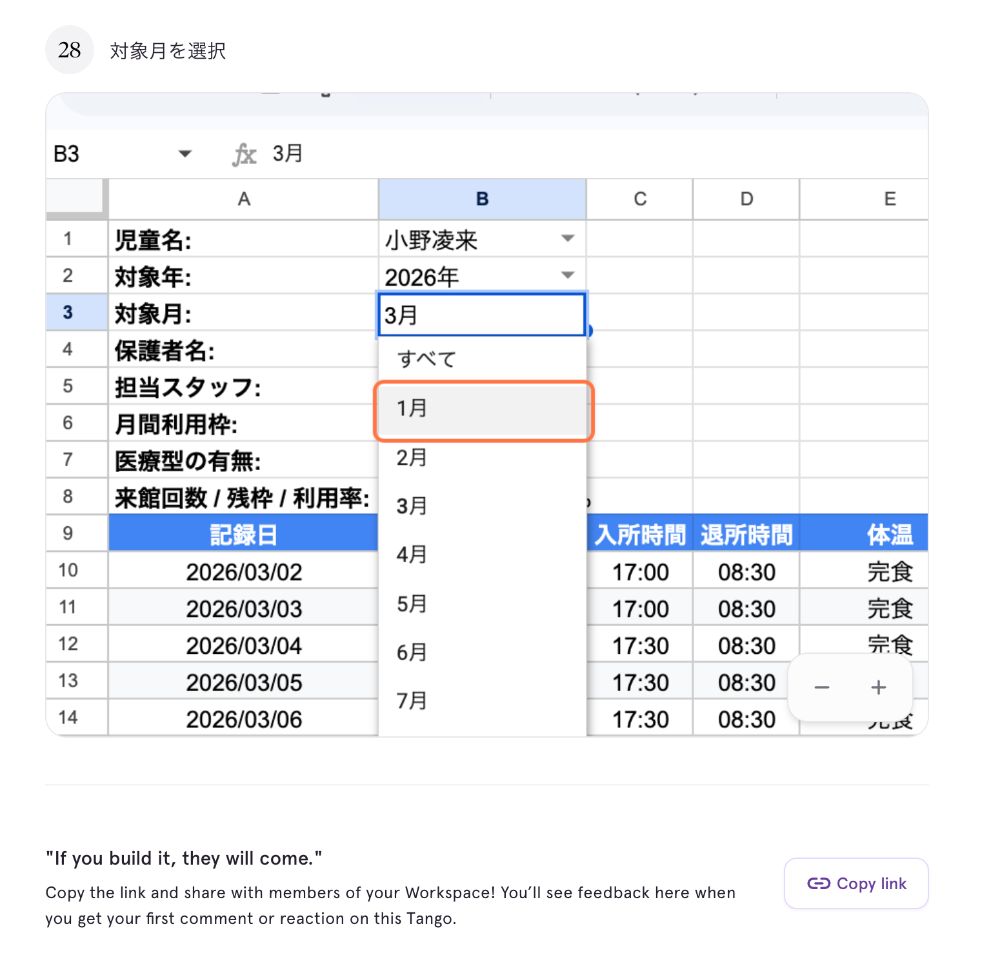

# 05. 児童別ビューを見る

## このページでやること

特定の児童1人の**来館履歴と基本情報**を絞り込んで表示します。
保護者報告や個別面談の資料として印刷するときにも使えます。

- **いつやるか**：保護者報告、個別面談、記録の見直しなど
- **かかる時間**：2〜3分
- **誰がやるか**：管理担当スタッフ

---

## 手順

### ① 「児童別ビュー」タブをクリック

スプレッドシート下部のタブから **「児童別ビュー」** を選びます。

### ② 「児童名」を選ぶ（B1セル）

**B1セル（児童名）** のプルダウンから、見たい児童の名前を選びます。

> プルダウンに出てこない場合は、[10_児童を追加する.md](10_児童を追加する.md) で児童マスタに登録されているか確認してください。

### ③ 「対象年」を選ぶ（B2セル）

**B2セル（対象年）** のプルダウンから年を選びます。

### ④ 「対象月」を選ぶ（B3セル）

**B3セル（対象月）** のプルダウンから月を選びます。

### ⑤ 表示される情報

児童の基本情報と、その期間の来館記録が一覧で表示されます。

**基本情報エリア（上部）:**

| 項目 | 内容 |
|---|---|
| 児童名 | 選んだ児童の名前 |
| 対象年・対象月 | 選んだ期間 |
| 保護者名 | 登録されている保護者の名前 |
| 担当スタッフ | 主な担当スタッフ |
| 月間利用枠 | その月に使える上限回数 |
| 医療型の有無 | 医療型利用枠の対象かどうか |
| 来館回数 / 残枠 / 利用率 | 実績と残数 |

**来館記録エリア（下部）:**

記録日・スタッフ名・入退所時間・体温・食事などが日付順に並びます。

---

## 印刷するとき

このシートは **A4横向き** で1枚に収まるように作られています。

1. メニューから **「ファイル」→「印刷」** を選びます
2. 「用紙サイズ」を **A4**、「向き」を **横** に設定
3. 「余白」を **標準** にしてプレビュー確認
4. 問題なければ **印刷** をクリック

---

## よくあるトラブル

| 症状 | 原因と対処 |
|---|---|
| 記録が何も出ない | B1が「すべて」のまま。児童名を選んでください |
| 特定の児童がプルダウンに出ない | 児童マスタに登録されていません。[10_児童を追加する.md](10_児童を追加する.md) を確認 |
| 古い記録しか出ない | B2/B3の対象年月を確認してください |

---

## 大事な注意

- 表示されている情報は**自動で取得**されます。直接書き換えないでください。
- 修正したい場合は **Webビュー（修正ツール）** を使ってください → [フォーム回答の修正ツール 操作マニュアル](../manual_form-edit.md)
