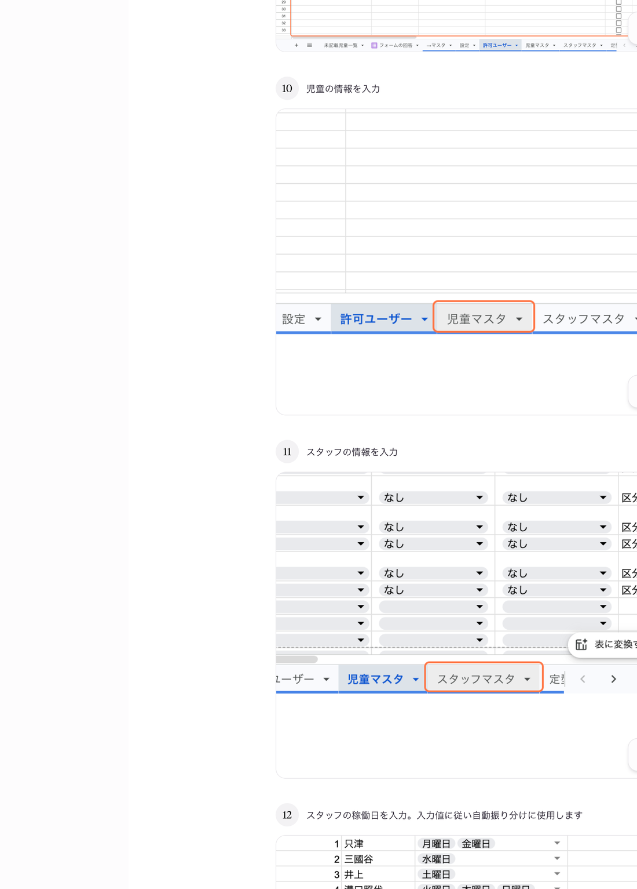

# 10. 児童を追加する

## このページでやること

新しく利用する児童の情報を登録します。
登録すると、フォームのプルダウン選択肢や月別集計などに自動で反映されます。

- **いつやるか**：新しい児童の利用が決まったとき
- **かかる時間**：3〜5分
- **誰がやるか**：管理担当スタッフ

---

## 手順

### ① 「児童マスタ」タブをクリック

スプレッドシート下部のタブから **「児童マスタ」** を選びます。

### ② 一番下の空いている行に情報を入力

下にスクロールして、空いている行を見つけて入力します。

| 列 | 入力内容 | 例 |
|---|---|---|
| 児童名 | 児童のフルネーム | 山田太郎 |
| よみがな | ひらがな（並び替え用） | やまだたろう |
| 保護者名 | 保護者のフルネーム | 山田花子 |
| 保護者メール | 報告メールの送信先 | yamada@example.com |
| 月間利用枠 | その月の利用回数上限 | 20 |
| 医療型 | 医療型なら「あり」、通常は「なし」 | なし |
| 曜日1〜 | 利用予定の曜日 | 月曜日・水曜日 |
| 担当スタッフ1 | 主な担当スタッフ | 溝口照代 |
| 担当スタッフ2 | サブ担当（なければ空欄） | |
| 区分 | 児童の区分（プルダウンから選択） | 区分1 |

> **注意**：プルダウンがある列は、必ずプルダウンから選んでください。手入力すると正しく反映されません。

### ③ 「ドロップダウンを更新」を実行

児童を追加したら、**フォームと他のシートの選択肢に反映**するため、以下を実行します。

1. メニューバーの **「来館管理」** をクリック
2. **「ドロップダウンを更新」** を選ぶ
3. 完了メッセージが出るまで1〜2分待つ

これを実行しないと、フォームの児童名プルダウンに新しい児童が出てきません。

---

## 児童を削除・休止したいとき

- **完全に削除する場合**：その行ごと削除してください。ただし過去の記録との整合性に注意。
- **一時的に休止する場合**：管理者に相談してください（「退所フラグ」など専用の管理方法があります）。

---

## よくあるトラブル

| 症状 | 原因と対処 |
|---|---|
| フォームの児童名プルダウンに出てこない | 「ドロップダウンを更新」の実行漏れ。メニュー→来館管理→ドロップダウンを更新 |
| 月別集計に出てこない | 「ドロップダウンを更新」後に再度スプレッドシートを開き直してください |
| メールが送信されない | 保護者メールの綴り間違い・半角/全角ミスを確認してください |

---

## 大事な注意

- 既存の児童の行を**並び替えたり削除したりしない**でください。他のシートとの連携が壊れます。
- 児童名は**半角スペースや全角スペースの入り方**を統一してください（例：「山田 太郎」と「山田太郎」は別人として扱われます）。

---

## 関連

- 児童を登録したあとは [05_児童別ビューを見る.md](05_児童別ビューを見る.md) で正しく表示されるか確認してください。
