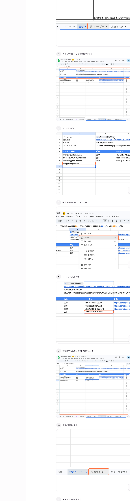
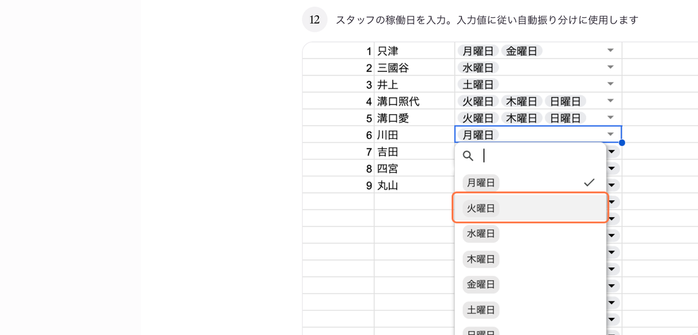

# 11. スタッフを追加する

## このページでやること

新しく入ったスタッフの情報を登録し、**修正ツール（Webビュー）を使うためのリンク（トークン）**を発行します。

- **いつやるか**：新しいスタッフが入ったとき、稼働日が変わったとき
- **かかる時間**：5〜10分
- **誰がやるか**：管理担当スタッフ

---

## 手順の流れ

1. スタッフマスタにスタッフ情報を入力
2. 稼働曜日を設定
3. 許可ユーザーシートでメールを追加してトークンを発行
4. トークンをコピーしてメール列に貼り付け
5. 「ドロップダウンを更新」を実行

---

## ① スタッフマスタに情報を入力

スプレッドシート下部のタブから **「スタッフマスタ」** を選び、空いている行に以下を入力します。

| 列 | 入力内容 | 例 |
|---|---|---|
| スタッフ名 | スタッフのフルネーム | 田中一郎 |
| よみがな | ひらがな | たなかいちろう |
| 区分1 | スタッフ区分1 | 正社員 |
| 区分2 | スタッフ区分2 | 保育士 |

> **注意**：プルダウンがある列は、必ずプルダウンから選んでください。

---

## ② 稼働曜日を設定

同じ行の **曜日1〜曜日5** の列に、そのスタッフが働く曜日をプルダウンから選んで入力します。

| 例 | 設定内容 |
|---|---|
| 溝口照代 | 月曜日・金曜日 |
| 三國谷 | 水曜日 |
| 川田 | 月曜日・火曜日 |

> この情報は **自動振り分け**（どのスタッフがどの日に担当するかの予測）に使われます。必ず正しく設定してください。

---

## ③ 許可ユーザーシートでメールを追加

### ③-1 「許可ユーザー」タブをクリック

スプレッドシート下部のタブから **「許可ユーザー」** を選びます。

### ③-2 空いている行にメールアドレスを入力

- A列（メールアドレス）：スタッフのGoogleアカウントのメール
- B列（氏名）：スタッフ名

メールアドレスを入力すると、自動で**トークン（ランダムな文字列）**が右の列に生成されます。

### ③-3 生成されたトークンをコピー

トークンが入ったセルを右クリック → **「コピー」** を選びます。

### ③-4 そのまま貼り付け（値として保持）

同じセルに再度右クリック → **「特殊貼り付け」→「値のみ貼り付け」** を選びます。

> **なぜこの操作が必要？**
> トークンは数式で自動生成されます。値として貼り付けることで、今後シートの計算をやり直してもトークンが変わらなくなります。これをしないと、スタッフのリンクが**ある日突然使えなくなる**ことがあります。

### ③-5 E列（有効）にチェック

そのスタッフを有効化するため、E列のチェックボックスに**✓**を入れます。

---

## ④ スタッフにリンクを共有

許可ユーザーシートのURL列に表示されている**個別リンク**を、そのスタッフに共有します。

- リンクはスタッフ個別のもの。**他人と共有しないでください**。
- リンクをブラウザで開くと、Webビュー（修正ツール）が使えます。

---

## ⑤ 「ドロップダウンを更新」を実行

スタッフを追加したら、**フォームの担当スタッフ選択肢に反映**するため、以下を実行します。

1. メニューバーの **「来館管理」** をクリック
2. **「ドロップダウンを更新」** を選ぶ
3. 完了メッセージが出るまで待つ

---

## スタッフを外すとき

- 許可ユーザーシートのE列（有効）の**チェックを外します**。これで個別リンクが使えなくなります。
- スタッフマスタの行自体は残しておいても問題ありません（過去の記録との整合性のため）。

---

## よくあるトラブル

| 症状 | 原因と対処 |
|---|---|
| スタッフが発行されたリンクを開けない | E列（有効）のチェックが外れている、またはトークンが値貼り付けされていない |
| フォームのスタッフ名プルダウンに出てこない | 「ドロップダウンを更新」の実行漏れ |
| トークンがある日突然無効になった | 値貼り付けをしていないため、数式の再計算で変わってしまった。再発行が必要 |

---

## 大事な注意

- トークンは**パスワードと同じ扱い**です。スタッフ本人にだけ共有してください。
- 許可ユーザーシートの**設定ページ情報（A1〜A5）**は絶対に書き換えないでください。
