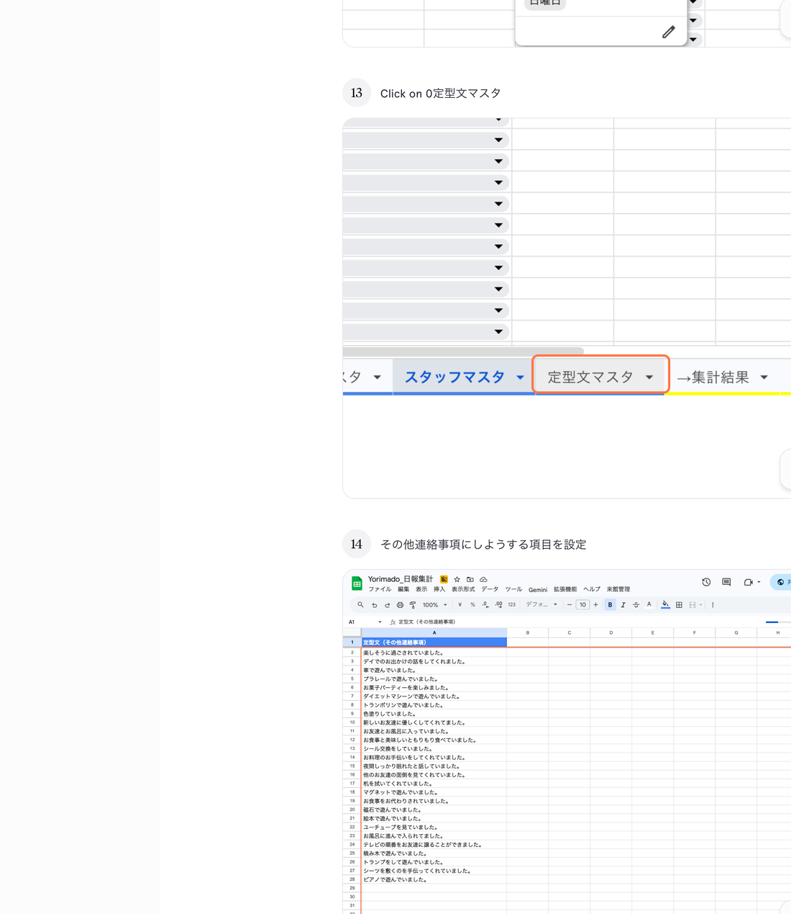

# 12. 定型文を編集する

## このページでやること

フォームの「連絡事項」でよく使う文言をあらかじめ登録しておきます。
登録した定型文は、フォーム送信時にプルダウンから選べるようになります。

- **いつやるか**：よく使う連絡文言を追加したいとき、表現を統一したいとき
- **かかる時間**：3分くらい
- **誰がやるか**：管理担当スタッフ

---

## 手順

### ① 「定型文マスタ」タブをクリック

スプレッドシート下部のタブから **「定型文マスタ」** を選びます。

### ② 空いている行に定型文を入力

A列にそのまま文章を入力するだけです。

**登録例：**

| A列（定型文） |
|---|
| 楽しく過ごされていました。 |
| プールで遊ばれてました。 |
| 少し元気がないご様子でした。 |
| 食欲は普段通りでした。 |
| 体調を崩されていました。 |

> **ポイント**：一文ごとに1行で入力してください。長文を1行に詰め込まないでください。

### ③ 「ドロップダウンを更新」を実行

定型文を追加・変更したら、フォームに反映するため以下を実行します。

1. メニューバーの **「来館管理」** をクリック
2. **「ドロップダウンを更新」** を選ぶ
3. 完了メッセージが出るまで待つ

---

## 定型文を削除するとき

- その行の内容を**空欄にする**（Deleteキー）だけでOKです。
- 行ごと削除すると、他の定型文の順番が詰まります。順序を保ちたい場合は空欄にするのが安全です。
- 削除後は **「ドロップダウンを更新」** を忘れずに実行してください。

---

## よくあるトラブル

| 症状 | 原因と対処 |
|---|---|
| フォームのプルダウンに出ない | 「ドロップダウンを更新」の実行漏れ |
| 複数行に分かれて表示される | セル内に改行が入っている可能性。Backspaceで改行を削除してください |
| 長すぎて途中で切れる | 1行の文字数を短めにしてください（50文字以内を推奨） |

---

## 大事な注意

- 同じ文言を**2行以上登録しない**でください（重複の原因になります）。
- 表現を統一することで、あとで集計や検索がしやすくなります。
