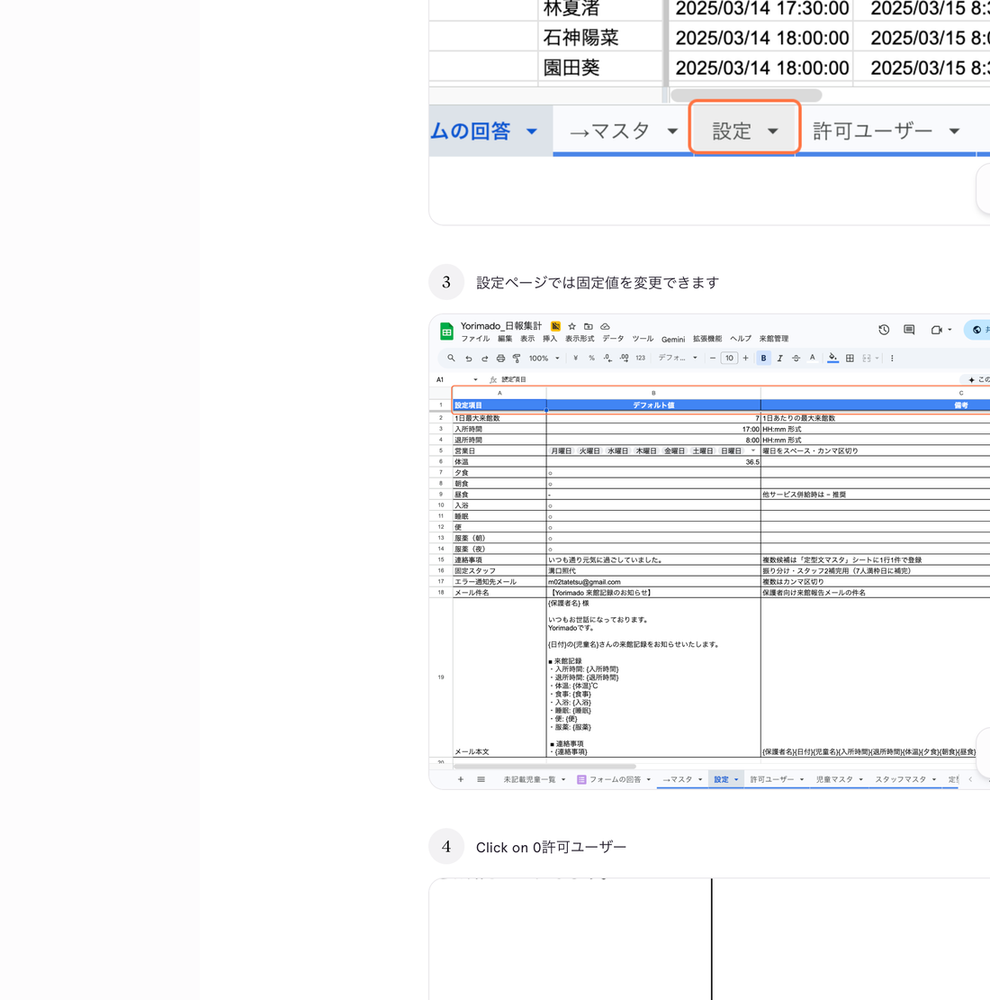

# 13. 設定を変更する

## このページでやること

システム全体の基本設定（メール文面、営業日、デフォルト値など）を変更します。

> ⚠️ **このページは管理者専用です**。
> 設定を誤って変更すると、**全児童の振り分けやメール送信が正しく動かなくなる**可能性があります。
> 内容を理解したうえで慎重に操作してください。

- **いつやるか**：メール文面を変えたいとき、営業時間を変えたいとき
- **かかる時間**：5〜10分
- **誰がやるか**：管理者のみ

---

## 手順

### ① 「設定」タブをクリック

スプレッドシート下部のタブから **「設定」** を選びます。

### ② 変更したい項目の値を書き換える

設定シートは、A列に「項目名」、B列以降に「値」が入っています。
**B列の値だけを変更**してください。A列の項目名は絶対に変えないでください。

### ③ 主な設定項目

| 項目名 | 説明 | 変更してよいか |
|---|---|---|
| デフォルト入所時間 | フォームで入所時間が空欄のときの初期値（例：17:00） | ◯ 管理者の判断で変更可 |
| デフォルト退所時間 | フォームで退所時間が空欄のときの初期値（例：08:30） | ◯ |
| メール件名 | 保護者への報告メールの件名テンプレート | ◯ 文言のみ |
| メール本文 | 保護者への報告メールの本文テンプレート | ◯ 文言のみ |
| 営業日 | 来館可能な曜日 | △ 慎重に |
| 休業日 | 来館対象外の日付 | △ 慎重に |

### ④ メール本文のプレースホルダ

メール本文には以下のような `{保護者名}` のような**プレースホルダ**が使えます。
送信時にこれが自動で置き換わります。

| プレースホルダ | 置き換わる内容 |
|---|---|
| `{保護者名}` | その児童の保護者名 |
| `{日付}` | 来館日 |
| `{児童名}` | 児童の名前 |
| `{入所時間}` | 入所時刻 |
| `{退所時間}` | 退所時刻 |
| `{体温}` | 体温 |

プレースホルダの**名前は絶対に変えないでください**。`{保護者名}` を `{親の名前}` などに書き換えるとメールが正しく送信されません。

---

## 絶対に変えてはいけないもの

- A列の項目名
- プレースホルダの名前（`{保護者名}` `{日付}` など）
- 設定シートのシート名そのもの
- 色付きセルや結合セル（見出しやラベル）

---

## よくあるトラブル

| 症状 | 原因と対処 |
|---|---|
| メールが送信されない | メール本文のプレースホルダが壊れている可能性。元の状態に戻して再確認 |
| 振り分けが全員同じ日になる | 営業日の設定が誤っている可能性 |
| 送信メールに `{保護者名}` がそのまま出る | プレースホルダ名の綴り違い。正しい名前に戻してください |

---

## 元に戻したいとき

変更する前の値をメモしていない場合は、**スプレッドシートの変更履歴**から復元できます。

1. メニューから **「ファイル」→「変更履歴」→「変更履歴を表示」**
2. 変更前の版を選んで **「この版を復元」**

---

## 大事な注意

- 設定を変更する前に、**現在の値を必ずメモ**してください。
- 本番運用中のシートでいきなり変更せず、可能ならテスト環境で確認してから反映してください。
- 自信がない設定変更は**開発者（エンジニア）に相談**してください。
