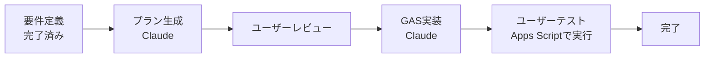

# AI間連携ルール

## 連携するAIエージェント

| エージェント | 役割 | 主な担当範囲 |
|---|---|---|
| Claude Code | 設計・GAS実装・レビュー | 要件定義、アーキテクチャ設計、GASコード生成 |

## プランファイルの扱い

GAS機能を実装する前に、プランファイルを作成して確認を取る。

```markdown
## 実装方針
- **何を**: [実装する機能（F-01〜F-08）]
- **なぜ**: [選択した理由・却下した選択肢]
- **どのように**: [具体的な実装ステップ]

## 想定リスク
- [懸念点や考慮すべき副作用]

## 確認が必要な点
- [不確かな仕様・ユーザーへの質問事項]
```

## タスク分担フロー



## ファイル受け渡し規約
- プランファイル: `plans/YYYYMMDD-feature-name.md`
- 設計書: `docs/` 配下
- GASコード: `gas/` 配下（ローカル管理用）

## GASコードの受け渡し方法
- Claude CodeがGASコードを `gas/` ディレクトリに出力する
- ユーザーがApps Scriptエディタにコピペして実行する
- 直接的なスプレッドシート接続手段はないため、この運用とする

## 禁止事項
- プランファイルに「意思決定の理由」が含まれていない場合は実装を開始しない
- AIが判断できない仕様の曖昧さは、必ず人間に確認を取ってから進めること
- 要件定義書（docs/requirements.md）にない機能を勝手に追加しない
